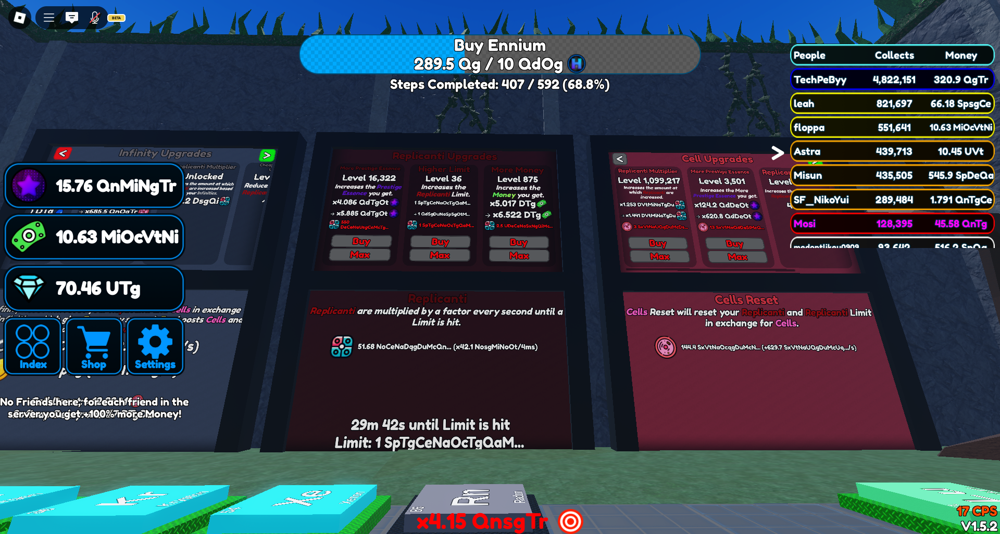
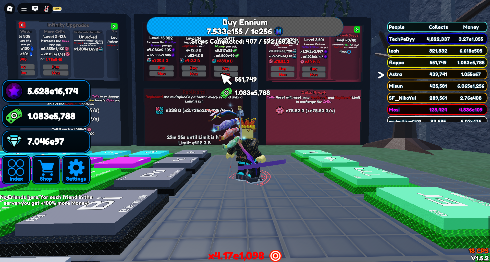

# Infinite Money Simulator

*A simple incremental money-making game built with HTML, CSS, and JavaScript*

## What is this game?

This is an idle/incremental game where you automatically earn money over time and use that money to buy upgrades that make you earn even more money. It's designed to be simple and addictive.

## How to play

1. **Watch your money grow** - Money automatically increases every second
2. **Buy upgrades** - Use your money to purchase upgrades that increase your earning rate
3. **Get multipliers** - Buy multiplier upgrades to dramatically boost your income
4. **Optimize your strategy** - Balance between base income upgrades and multipliers

## Game Features

### Upgrades Available

- **+1 Money/sec** - Increases your base earning rate by 1 per second
- **+10 Money/sec** - Increases your base earning rate by 10 per second  
- **x2 Multiplier** - Doubles your total earning rate
- **Reduce Time Interval** - Makes money generate faster (reduces delay between earnings)

### Game Mechanics

- **Automatic earning** - Money generates passively without clicking
- **Scaling costs** - Upgrade prices increase each time you buy them
- **Session timer** - Tracks how long you've been playing
- **Number formatting** - Large numbers display with suffixes (K, M, B, T, etc.)
- **Cheat system** - Hidden cheat menu for testing large numbers

## Technical Implementation

- **Pure JavaScript** - No external libraries required
- **Simple number system** - Uses JavaScript numbers with suffix formatting
- **Real-time updates** - UI updates automatically as money increases
- **Responsive design** - Works on desktop and mobile browsers

## Game Balance

The game is intentionally easy and fast-paced compared to typical incremental games. Money grows quickly and upgrades become affordable relatively fast, making it satisfying for short play sessions.

## Cheat System

A hidden cheat system allows you to unlock a special menu by entering a passcode. This lets you test large numbers and see how the game handles extreme values.

To access it, click the "🧪 Test Large Numbers (Cheat)" button and enter the passcode when prompted

99% of you guys will use because no one wait on this game, it is not ROBLOX, it is not saving your data. Feel free to use it, but remember that this is just a test for large numbers, not a real cheat system.

## Contributors

| Contributors      | Help Percentage | Rating | Comment                                            |
|-------------------|-----------------|--------|----------------------------------------------------|
| GitHub Copilot    | 70%             | 8/10   | Sometimes dumbass                                 |
| ChatGPT           | 20%             | 7/10   | Best for small help, sometimes useless             |
| DeepSeek          | 10%             | 5/10   | Works well when others are broken, but too many server errors |

## Known Issues

- Game can be easily hacked through browser console
- No save system - progress resets on page refresh
- Performance may slow down with extremely large numbers

## Version

22:00:00 22 July 2025

## Infinite Money Simulator

A game that focuses purely on buying upgrades and watching money increase very fast! Much simpler than traditional clicker games since there's no clicking required - just pure idle progression.

### Comparison to Traditional Incremental Games

- **No clicking required** - Money generates automatically
- **Faster progression** - Upgrades become affordable quickly  
- **Simpler mechanics** - Focus on just a few upgrade types
- **Higher multipliers** - Numbers grow more dramatically
- **Easier to play** - Less complex strategy required

